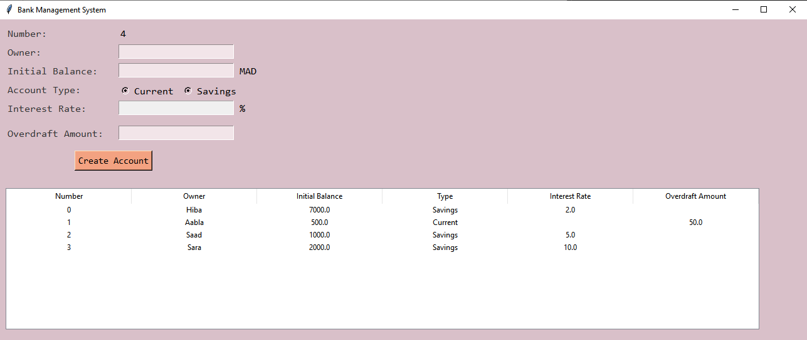

## Description
This Python application allows users to manage bank accounts through a graphical user interface (GUI) built with Tkinter. The system facilitates the creation of both current and savings accounts, displaying their details in a tabular format. Users can add new accounts, view existing ones, and load previously saved account data from a JSON file.

## Features
♡  &nbsp;  Account creation for Current and Savings accounts  
♡  &nbsp;  Displaying account details in a user-friendly Treeview widget  
♡  &nbsp;  Saving and loading account data to/from a JSON file  

## Screenshot

## Files
♡  &nbsp;  account_classes.py: Contains classes for Account, CurrentAccount, and SavingsAccount.  
♡  &nbsp;  main.py: Main file with the GUI and account management functions.  
♡  &nbsp;  account_data.json: JSON file for storing account information.  

## Prerequisites
♡  &nbsp;  Python 3.x  
♡  &nbsp;  Tkinter library (usually comes with Python installation)  

## Usage

♡  &nbsp;  Clone or download the repository &nbsp;   ``git clone https://github.com/er-hiba/Bank_Account_Management-Tkinter.git``  
♡  &nbsp;  Navigate to the project directory  &nbsp;  ``cd Bank_Account_Management-Tkinter``   
♡  &nbsp;  Run the 'main.py' file &nbsp;  ``python main.py``  
♡  &nbsp;  Fill in the required account details and click 'Create Account'.  
♡  &nbsp;  View the created accounts in the table.  
♡  &nbsp;  Existing account data will be loaded automatically when the application starts.  

## Notes
This project is intended for educational purposes and does not cover advanced banking operations. The UI is built using Tkinter, providing a simple interface for account management.
